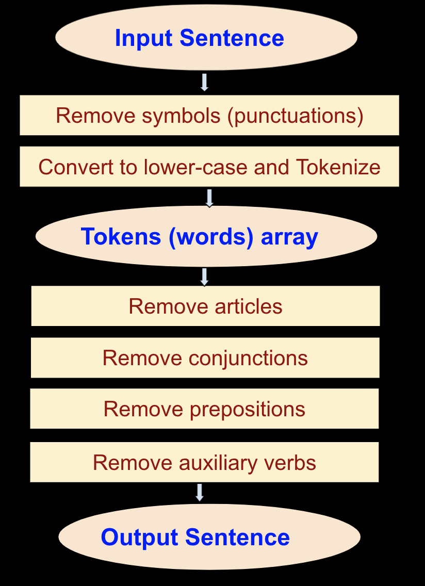

Compares two sentences based on their meaning using Javascript

## <a target="_blank" href='https://abhinandan-kushwaha.github.io/sentence-comparison-based-on-meaning/'>Try it here</a>

## How It works

### 1. Tokenizing and Text pre-processing



### 2. Comparing for similarity

After preprocessing both the sentences using above approach, we get 2 set of tokens, one for each sentence. We perform following operations on each set of tokens-<br/>
For example, if the sentences were -
<p style="margin:20px;color: #454545;">
    <b><i>They made this project.</i></b>&nbsp; &nbsp; and &nbsp; &nbsp; <b><i>This project is made by them.</i></b> <br/>
</p>
<br/>
Then the tokens will be -
<p style="margin:20px;color: #7a3c3c;">
    <b><i>they, made, this, project</i></b>&nbsp; &nbsp; and &nbsp; &nbsp; <b><i>this, project, made, them</i></b> <br/>
</p>

<br/>
1. Find the bigger token set and assign it to s1. Assign the smaller one to s2. <br/> 
3. let maxLength = length of s1<br/>
4. let minLength = lenngth of s2 <br/>
5. Make a matrix named similarities with <i>maxLength</i> rows and <i>minLength</i> columns <br/>
6. similarities = [maxLength][minLength] <br/>

```
for each token t1 in s1, do{
    for each token t2 in s2, do{
        similarities[row][colunm] = similarityUsingLevenshteinDistance(t1,t2)
    }
}
```
<br/>
6. This generates a table of similarities between the tokens taken from the 2 sentences<br>
7. Now find the highest sum of similarities from the table, such that no two similarity values come from the same row or same column<br/>
<table>
    <tr>
        <td style="background-color: lightgray;"></td>
        <td style="background-color: rgb(219, 249, 255); font-weight: bold;">this</td>
        <td style="background-color: rgb(219, 249, 255); font-weight: bold;">project</td>
        <td style="background-color: rgb(219, 249, 255); font-weight: bold;">made</td>
        <td style="background-color: rgb(219, 249, 255); font-weight: bold;">them</td>
    </tr>
    <tr>
        <td style="background-color: rgb(219, 249, 255); font-weight: bold;">they</td>
        <td>0.5</td>
        <td>0.14</td>
        <td>0</td>
        <td style="background-color: aquamarine;">0.75</td>
    </tr>
    <tr><td style="background-color: rgb(219, 249, 255); font-weight: bold;">made</td>
        <td>0</td>
        <td>0.14</td>
        <td style="background-color: aquamarine;">1</td>
        <td>0</td>
    </tr>
    <tr>
        <td style="background-color: rgb(219, 249, 255); font-weight: bold;">this</td>
        <td style="background-color: aquamarine;">1</td>
        <td>0</td>
        <td>0</td>
        <td>0.5</td>
    </tr>
    <tr><td style="background-color: rgb(219, 249, 255); font-weight: bold;">project</td>
        <td>0</td>
        <td style="background-color: aquamarine;">1</td>
        <td>0.14</td>
        <td>0.14</td>
    </tr>
</table>
<br/>
sum = 3.75
<br/>
<br/>
Divide this sum by maxLength to get the average similarity
<br/>
average = 3.75 / 4 = 0.9375<br/>
<b>Similarity = 93.75%</b>

### References
<a target="_blank" href='https://en.wikipedia.org/wiki/Levenshtein_distance'>Levenshtein distance</a>
